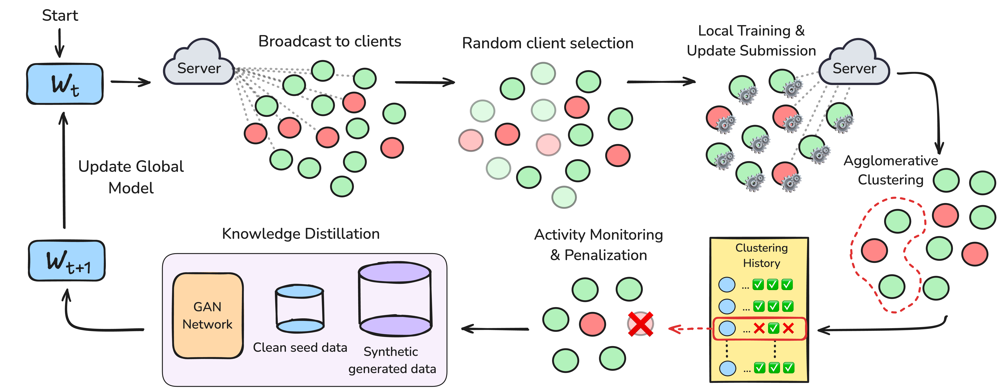

# DROP: Poison Dilution via Knowledge Distillation for Federated Learning

<p align="center">
    
</p>

## Abstract

Federated Learning is vulnerable to adversarial manipulation, where malicious clients can inject poisoned updates to influence the global model’s behavior. While existing defense mechanisms have made notable progress, they fail to protect against adversaries that aim to induce targeted backdoors under different learning and attack configurations. To address this limitation, we introduce DROP (Distillation-based Reduction Of Poisoning), a novel defense mechanism that combines clustering and activity-tracking techniques with extraction of benign behavior from clients via knowledge-distillation to tackle stealthy adversaries that manipulate low data poisoning rates and diverse malicious client ratios within the federation. Through extensive experimentation, our approach demonstrates superior robustness compared to existing defenses across a wide range of learning configurations. Finally, we evaluate existing defenses and our method under the challenging setting of non-IID client data distribution and highlight the challenges of designing a resilient FL defense in this setting.

## Codebase Overview

The `main.py` script is responsible for simulating the federated learning experiments. The `entity/` package contains all the required code for the participating parties within the federation (different types of `Server` and `Client`) and dataset handling code. The `config/` directory contains the configuration of every baseline for each of the datasets that were used to evaluate the framework. 

**e.g.** To run a DROP-for-CIFAR-10 experiment:

```bash
python main.py --config entity/configs/cifar10/drop.json --cuda 0 > logs/cifar10_run.log
```

Our codebase uses the `simple_parsing` module. You can dynamically change hyperparameters without modifying the JSON configuration files.

**e.g.** changing the Data Poisoning Rate (DPR) for the backdoor attack before running an experiment:

```bash
python main.py --config entity/configs/cifar10/drop.json --DPR 0.25 --cuda 0
```


## Installation

Import the conda environment for the project (_Optional_, you can use your own packages) :

```bash
conda env create -f drop.yml
```

Install the `entity` python package in edit mode:

```bash
pip install -e .
```

## CINIC-10 port

Code integration for CINIC-10 exists in `dataset.py`. 

Download the CINIC-10 zip and place it in the desired dataset directory (`data/` will be chosen as the default by the source code):

```
wget https://datashare.ed.ac.uk/download/DS_10283_3192.zip
```

Unzip:

```
unzip DS_10283_3192.zip
```

Create `cinic-10/` directory and untar:

```
mkdir cinic-10 && cd cinic-10 && tar -zxvf CINIC-10.tar.gz
```

Example usage from within the entity directory:

```python
>>> cinic10 = BackdoorableCINIC10(root='path/to/desired/directory/cinic-10', split='train')
```
